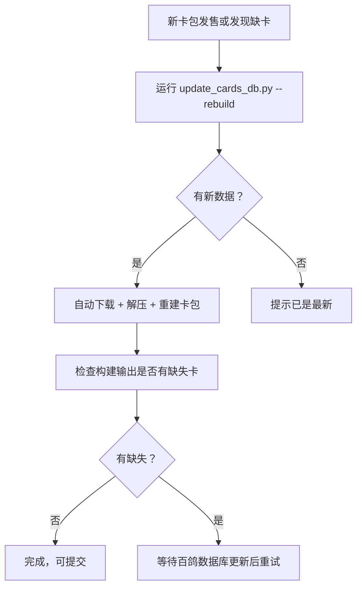
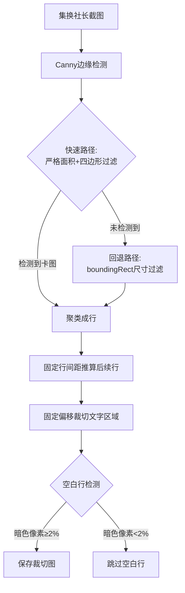
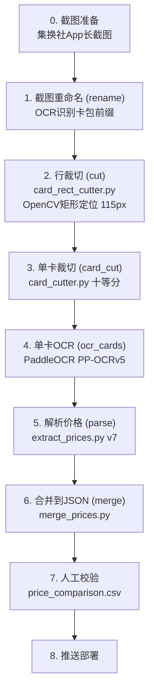
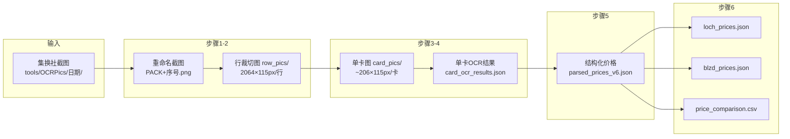
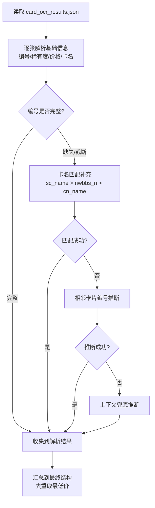

# 🛠️ 工具脚本说明

> 从 DEVELOPMENT.md 拆分，详述各 Python 工具脚本的用法。

## `update_cards_db.py` — 百鸽(YGOCDB) 卡牌数据库更新脚本

从百鸽 API (`ygocdb.com/api/v0/cards.zip`) 下载全量卡牌数据库，替换本地 `tools/db/cards.json`。
使用 MD5 校验实现增量更新，只有数据有变化时才重新下载。

| 命令 | 说明 |
|------|------|
| `python tools/update_cards_db.py` | 检查更新并下载（有更新才下载） |
| `python tools/update_cards_db.py --force` | 强制重新下载（跳过 MD5 检查） |
| `python tools/update_cards_db.py --check` | 只检查是否有更新，不下载 |
| `python tools/update_cards_db.py --rebuild` | 下载后自动运行 build_pack_data.py 重建所有卡包 |
| `python tools/update_cards_db.py --info` | 查看本地 cards.json 信息和远程 MD5 |

> 💡 推荐工作流：`python tools/update_cards_db.py --rebuild`（一键更新数据库 + 重建卡包）
> ⚠️ 百鸽服务器是作者自费维护的，请合理使用，不要频繁调用。

### 📋 卡牌数据库更新完整工作流

当需要更新卡牌数据库时（通常是新卡包发售后），按以下流程操作：



```bash
# 推荐：一键更新 + 重建
python tools/update_cards_db.py --rebuild

# 或分步操作：
python tools/update_cards_db.py          # 步骤1：下载最新数据库到 tools/db/cards.json
python tools/build_pack_data.py          # 步骤2：用新数据库重建所有卡包

# 只更新特定卡包：
python tools/build_pack_data.py ocg_blzd
```

> 📁 **数据文件位置**：`tools/db/cards.json`（约12MB，已被 .gitignore 忽略，不会提交到 Git）
> 🔄 **更新频率**：新卡包发售时更新一次即可，无需频繁更新

## `build_pack_data.py` — OCG 卡包数据构建脚本

从 `tools/db/cards.json`（YGOCDB 全量数据库）提取卡牌详情，注入到 `data/ocg/cards/*.json` 中。
构建后的卡包文件包含完整信息（中/日/英文名、攻防、效果），网页运行时无需调用 API。

| 命令 | 说明 |
|------|------|
| `python tools/build_pack_data.py` | 构建所有 OCG 卡包 |
| `python tools/build_pack_data.py ocg_blzd` | 只构建指定卡包 |
| `python tools/build_pack_data.py --check` | 检查哪些卡找不到（不修改文件） |
| `python tools/build_pack_data.py --info` | 查看 cards.json 统计信息 |

> ⚠️ 每次新增或更新卡包后，必须运行此脚本。

## `fetch_packs.py` — 卡包数据抓取工具

从 YGOCDB 网站抓取卡包数据的离线 Python 脚本。

| 命令 | 说明 |
|------|------|
| `python tools/fetch_packs.py list ocg` | 列出 OCG 卡包列表（默认 20 个） |
| `python tools/fetch_packs.py list tcg` | 列出 TCG 卡包列表（TCG 模式已移除，保留命令兼容） |
| `python tools/fetch_packs.py fetch <ID>` | 获取指定卡包卡牌收录 |
| `python tools/fetch_packs.py fetch <ID> --write` | 获取并写入独立文件 + 更新 packs.json |
| `python tools/fetch_packs.py latest ocg` | 获取最新一期 OCG 补充包 |
| `python tools/fetch_packs.py gen-list` | 更新卡包列表文件 |

## `fetch_yugiohmeta.py` — YugiohMeta 卡图映射表构建

从 YugiohMeta API 查询卡牌密码到 S3 CDN 图片 ID 的映射。

| 命令 | 说明 |
|------|------|
| `python tools/fetch_yugiohmeta.py build-all` | 为所有 TCG 卡包构建映射 |
| `python tools/fetch_yugiohmeta.py build "<setCode>"` | 为指定卡包构建映射 |
| `python tools/fetch_yugiohmeta.py test <password>` | 测试单张卡映射 |
| `python tools/fetch_yugiohmeta.py info` | 查看映射表信息 |

## `download_loch_images.py` — LOCH 卡图本地化下载

从 `loch_image_map.json` 读取所有 metaId / altMetaId，批量下载两个尺寸（_w200 小图 + _w420 大图）的 webp 图片到 `data/ocg/images/loch/` 目录。

| 命令 | 说明 |
|------|------|
| `python tools/download_loch_images.py` | 下载所有 LOCH 卡图（已存在的自动跳过） |

> 💡 支持断点续传：已存在且大小 > 0 的文件会自动跳过，中断后重新运行即可继续下载。

## `card_rect_cutter.py` — 集换社截图行裁切工具 ✂️

基于 OpenCV 卡图矩形定位的行级裁切工具，将集换社长截图精确裁切为每行的文字信息条（集换分 + 卡名 + 编号 + 价格），供后续 OCR 识别使用。

### 🎯 核心原理



**方案核心思想**：卡图是固定尺寸的竖向矩形，在截图中具有唯一的面积+宽高比+高度组合，可以精确定位。文字区域相对卡图底边的偏移量完全固定（无漂移），因此只需准确定位第一行卡图，后续行全部通过固定行间距推算。

### 📐 关键数据（像素级精确值）

以下数据基于集换社 App 在 MuMu 模拟器（1032×2064分辨率）中的截图分析得出：

| 参数 | 值 | 说明 |
|------|-----|------|
| **卡图尺寸** | ~154×224px | 宽×高，宽高比约0.688 |
| **卡图面积** | ~34000px² | 轮廓面积（contourArea） |
| **行间距** | 374~375px | 相邻行卡图中心y坐标之差，极度稳定 |
| **集换分偏移** | card_bottom + 24~26px | 第一层文字 |
| **卡名偏移** | card_bottom + 55~57px | 第二层文字 |
| **编号偏移** | card_bottom + 88~91px | 第三层文字 |
| **价格底边** | card_bottom + 111~112px | 文字区域下沿 |
| **裁切上沿** | card_bottom + 10px | 留14px上方余量 |
| **裁切下沿** | card_bottom + 125px | 留13px下方余量 |
| **裁切总高度** | 115px | 精确覆盖全部文字，无冗余 |

### 🔍 双路径检测策略

#### 快速路径（适用于大多数截图）

使用 `cv2.RETR_EXTERNAL` + `Canny(50,150)` 提取外轮廓，同时满足以下全部条件才认定为卡图：

| 过滤条件 | 阈值范围 | 排除的UI元素 |
|---------|---------|-------------|
| 轮廓面积 | 25000 ~ 38000 | 按钮(5k~10k)、标签栏(17k~21k) |
| 顶点数 | 恰好4个 | 非矩形轮廓 |
| 宽高比(w/h) | 0.65 ~ 0.72 | 搜索框(asp=2.7)、方形按钮(asp≈1.0) |
| 高度 | 215 ~ 235px | 按钮(85~96px)、标签(157~164px) |

#### 回退路径（适用于卡包等特殊页面）

当快速路径检测不到任何卡图时自动触发。原因：卡包页面的卡图内容复杂（封面图案），导致 Canny 边缘不完整，`contourArea()` 远小于预期（仅14000 vs 正常34000），但 `boundingRect()` 的宽高仍然准确。

使用 `cv2.RETR_LIST`（获取所有层级轮廓）+ 仅按 boundingRect 尺寸过滤：
- 宽度: 140 ~ 170px
- 高度: 215 ~ 235px  
- 宽高比: 0.65 ~ 0.72
- 对同位置的重复轮廓去重（保留面积最大的）

### 🚀 使用方法

```bash
# 前提：截图已放入 tools/OCRPics/YYYYMMDD/ 目录

# 测试模式：只处理第一张截图（验证效果）
python tools/card_rect_cutter.py 20260309

# 全量裁切：处理该日期目录下所有截图
python tools/card_rect_cutter.py 20260309 all
```

#### 输入

- 截图目录：`tools/OCRPics/YYYYMMDD/*.png`
- 截图来源：集换社 App 长截图（MuMu 模拟器 1032×2064 分辨率）

#### 输出

- 裁切图：`test_output/row_pics/row_XX_YY.png`（XX=截图序号，YY=行序号）
- 调试图：`test_output/row_pics/debug_XX.png`（标注了检测到的卡图矩形和裁切线）
- 每张裁切图尺寸为 **2064×115px**，包含一行完整的卡片信息（集换分+卡名+编号+价格）

#### 输出示例

12张截图 → 61张有效裁切图：

| 截图 | 检测方式 | 卡图数 | 行数 | 保存 | 跳过空白 |
|------|---------|-------|------|------|----------|
| 01~07 | 快速路径 | 8~42 | 4~6 | 4~6 | - |
| 08（卡包页） | **回退路径** | 6 | 2 | **2** | **跳过2行** |
| 09~12 | 快速路径 | 19~38 | 3~6 | 3~6 | 部分跳过 |

### ⚙️ 核心常量（代码中可调）

```python
# 卡图矩形过滤条件
CARD_RECT_MIN_AREA = 25000     # 面积下限
CARD_RECT_MAX_AREA = 38000     # 面积上限
CARD_RECT_ASPECT_MIN = 0.65    # 宽高比下限
CARD_RECT_ASPECT_MAX = 0.72    # 宽高比上限
CARD_RECT_MIN_H = 215          # 高度下限
CARD_RECT_MAX_H = 235          # 高度上限
CARD_RECT_MIN_W = 140          # 宽度下限
CARD_RECT_MAX_W = 170          # 宽度上限

# 行间距和裁切偏移
ROW_SPACING = 375              # 行间距（卡图cy之间）
CROP_OFFSET_TOP = 10           # 裁切上沿偏移
CROP_OFFSET_BOTTOM = 125       # 裁切下沿偏移
```

> ⚠️ **注意**：以上常量基于 MuMu 模拟器 1032×2064 分辨率。如果截图来源的分辨率不同，需要等比例调整这些常量。

### 🐛 调试技巧

1. **调试图**：每次裁切自动生成 `debug_XX.png`，绿色框=检测到的卡图矩形，黄线=行底边，红线=裁切上沿，蓝线=裁切下沿
2. **如果第一行定位不准**：检查卡图矩形过滤阈值是否匹配当前截图的卡图尺寸
3. **如果回退路径也检测不到**：可能截图分辨率变化，需重新分析卡图矩形特征并调整常量

---

## `ocr_workflow.py` — OCR 价格更新一键工作流 ⭐

整合 截图重命名 → 行裁切 → 单卡裁切 → 单卡OCR → 结构化解析 → 合并到价格JSON 的完整 6 步流程。

### 🚀 快速开始（推荐）

```bash
# 一键完整流程（截图日期为目录名）
local/venv/Scripts/python.exe tools/ocr_workflow.py 20260309

# 分步执行
local/venv/Scripts/python.exe tools/ocr_workflow.py 20260309 --step rename     # 步骤1: 截图重命名
local/venv/Scripts/python.exe tools/ocr_workflow.py 20260309 --step cut        # 步骤2: 行裁切
local/venv/Scripts/python.exe tools/ocr_workflow.py 20260309 --step card_cut   # 步骤3: 单卡裁切
local/venv/Scripts/python.exe tools/ocr_workflow.py 20260309 --step ocr_cards  # 步骤4: 单卡OCR
local/venv/Scripts/python.exe tools/ocr_workflow.py 20260309 --step parse      # 步骤5: 解析价格
local/venv/Scripts/python.exe tools/ocr_workflow.py 20260309 --step merge      # 步骤6: 合并到JSON

# 从某一步开始执行到最后（跳过已完成的步骤）
local/venv/Scripts/python.exe tools/ocr_workflow.py 20260309 --from card_cut   # 从单卡裁切开始
local/venv/Scripts/python.exe tools/ocr_workflow.py 20260309 --from parse      # 从解析开始
```

> 💡 **首次使用**：只需将集换社截图放入 `tools/OCRPics/YYYYMMDD/` 目录，然后运行一键命令即可。
> ⚠️ 需要 Python 3.11 虚拟环境 + PaddleOCR + GPU（RTX 4060 推荐）。

---

## `card_cutter.py` — 单卡裁切工具

将行裁切图按十等分裁切为独立的单卡图片，每张包含一张卡片的完整信息（集换分+卡名+编号+价格）。

### 核心原理

- 每张行裁切图宽度固定 2064px，包含最多 10 张卡片
- 按十等分裁切（2064/10 = 206.4px/张）
- 空白检测（像素标准差 < 15）自动排除未占满的行尾空白卡位
- 输出命名：`{卡包}{截图序号}_{行序号}_card{卡序号}.png`

```bash
# 独立运行
local/venv/Scripts/python.exe tools/card_cutter.py
```

> 💡 单卡裁切是精度提升的关键：每张卡独立 OCR 后编号识别几乎完美，远优于行级 OCR。

---

## `batch_ocr_cards.py` — 单卡批量 OCR 工具

> ℹ️ 该功能已内嵌到 `ocr_workflow.py` 的 `step_ocr_cards()` 中，无需独立调用。

使用 PaddleOCR PP-OCRv5 Server 高精度模型，批量识别所有单卡裁切图。

- 支持断点续传（已处理的文件自动跳过）
- 平均速度：~0.04s/张（GPU），远快于行级 OCR 的 ~0.58s/行
- 输出：`test_output/card_ocr_results.json`

```bash
# 独立运行
local/venv/Scripts/python.exe tools/batch_ocr_cards.py
```

---

## OCR 价格更新详细流程

通过集换社 App 截图 + PaddleOCR 识别 + 自动化解析脚本，批量更新卡片市场价格数据。

### 📋 完整工作流程（6 步）



### 数据流图



### 第 0 步：截图准备

在集换社 App（MuMu 模拟器，分辨率 2064×2752 ppi264）中：

1. 打开集换社 App → 搜索卡包编号（如 `LOCH-JP`、`BLZD-JP`）
2. 按价格排序，展开所有稀有度版本
3. 使用长截图功能保存完整列表
4. 将截图保存到 `tools/OCRPics/YYYYMMDD/` 目录下

> 📁 目录命名规则：`tools/OCRPics/日期/`，如 `20260309`
> ⚠️ **分辨率必须为 2064×2752**（MuMu 模拟器默认），否则裁切参数不匹配

#### 截图命名规范

| 截图内容 | 建议文件名 | 说明 |
|---------|-----------|------|
| LOCH 卡片价格 | `LOCH01.png ~ LOCH07.png` | 按编号顺序，卡包名+序号 |
| LOSP 卡片价格 | `LOSP01.png` | +1 辅助包单独搜索 |
| BLZD 卡片价格 | `BLZD01.png ~ BLZD03.png` | 按编号顺序 |
| BLZD 辅助包 | `BLZDS01.png` | 辅助包卡片 |

文件名的前缀（`LOCH`/`BLZD`/`LOSP`）用于自动判断卡包归属，**必须以卡包名开头**。

### 第 1 步：截图重命名（rename）

```bash
local/venv/Scripts/python.exe tools/ocr_workflow.py 20260309 --step rename
```

对所有未命名的截图（MuMu默认命名等）做一次OCR识别卡包前缀，然后按卡包分组编号重命名为 `{PACK}{序号}.png`（如 `LOCH01.png`、`BLZD03.png`）。已经以卡包名开头的截图跳过OCR。

- **输入**：`tools/OCRPics/YYYYMMDD/*.png`
- **输出**：原地重命名截图文件

### 第 2 步：行裁切（cut）

```bash
local/venv/Scripts/python.exe tools/ocr_workflow.py 20260309 --step cut
```

调用 `card_rect_cutter.py`，基于 OpenCV Canny边缘检测 + 卡图矩形定位，将长截图精确裁切为每行的文字信息条。卡包前缀直接从文件名提取（需先运行 rename 步骤）。

- **输入**：`tools/OCRPics/YYYYMMDD/*.png`
- **输出**：`test_output/row_pics/*.png`（每张 2064×115px）+ `test_output/crop_info.json`
- **调试**：`test_output/row_pics/debug_*.png`（标注卡图矩形和裁切线）

### 第 3 步：单卡裁切（card_cut）

```bash
local/venv/Scripts/python.exe tools/ocr_workflow.py 20260309 --step card_cut
```

调用 `card_cutter.py`，将行图按十等分裁切为独立单卡图。

- **输入**：`test_output/row_pics/*.png`
- **输出**：`test_output/card_pics/*.png`（每张 ~206×115px）+ `test_output/card_cut_info.json`
- 自动检测并跳过空白卡位
- 典型产出：12 张截图 → 61 行 → ~585 张单卡图

### 第 4 步：单卡 OCR（ocr_cards）

```bash
local/venv/Scripts/python.exe tools/ocr_workflow.py 20260309 --step ocr_cards
```

使用 PaddleOCR 逐张识别单卡图。**这是精度提升的关键环节**——单卡独立识别后编号准确率远高于行级。

- **输入**：`test_output/card_pics/*.png`
- **输出**：`test_output/card_ocr_results.json`
- **速度**：~0.04s/张（GPU），585 张约 24 秒
- 支持断点续传

### 第 5 步：解析价格（parse）

```bash
local/venv/Scripts/python.exe tools/ocr_workflow.py 20260309 --step parse
```

调用 `extract_prices.py`（v7 合并卡名匹配版），从 OCR 结果中提取结构化价格数据。

- **输入**：`test_output/card_ocr_results.json`
- **输出**：`test_output/parsed_prices_v6.json` + `test_output/price_extract_summary.txt`

#### 解析核心逻辑



**卡名匹配算法**（5 级策略）：
1. **完全匹配**：OCR 卡名 == 数据库卡名
2. **子串匹配**：OCR 卡名 ⊂ 数据库卡名，或反向
3. **前缀/后缀匹配**：头尾至少 3 字符吻合
4. **关键词匹配**：按分隔符拆分后的关键词命中
5. **LCS 最长公共子串**：字符重叠 ≥ 60%

**卡名来源优先级**：`sc_name`（集换社名）> `nwbbs_n`（NWBBS名）> `cn_name`（中文名）> `name_hint`

**价格反推稀有度**：当 OCR 无法识别稀有度时，用价格匹配该编号已有的稀有度数据自动推断。

#### 常见 OCR 识别问题

| 问题 | 现象 | 脚本处理方式 |
|------|------|------------|
| 编号截断 | `LOCH-JP0...UTR` → `LOCH-JP0` | 数字不足2位视为截断，触发卡名匹配 |
| 0/O 混淆 | `LOCH-JPO67` | 正则容错处理 |
| 稀有度拆分 | `PSER` → `PSE R` | 合并相邻文本后重新匹配 |
| 价格缺小数点 | `19.89` → `1989` | 价格范围校验 |
| `--` 价格 | 未收录卡 → `¥--` | 标记为"未收录"，保留旧价格 |
| 稀有度遮挡 | UI 元素遮挡稀有度标签 | 价格反推稀有度 + 硬修复兜底 |
| GMR-OF 双版本 | 同编号两条 GMR-OF | 左侧=亚洲版，右侧=日本版，取亚洲版 |

### 第 6 步：合并到价格 JSON（merge）
```bash
local/venv/Scripts/python.exe tools/ocr_workflow.py 20260309 --step merge
```

调用 `merge_prices.py`，将解析结果智能合并到最终价格文件。

> ⚠️ **前提条件**：必须先完成第5步解析价格

#### 合并时附加的校验规则

在合并阶段会应用以下严格校验（直接保留旧值）：

| 检测规则 | 描述 | 处理方式 |
|---------|------|---------|
| GMR-OF < ¥1000 | GMR 不应如此便宜 | 保留旧值 |
| 基础稀有度(UR/SR/R/N) > ¥100 | 低级稀有度不应太贵 | 保留旧值 |
| SER ≈ PSER-OF | 同行串扰 | 保留旧值 |
| SER ≥ PSER | 低级比高级贵 | 保留旧值 |
| 变化 > 10x | 剧烈波动 | 保留旧值（标记可疑） |
| PSER < ¥1 | 可能是 N/R 串扰 | 过滤掉 |
| N/R > ¥5 | BLZD 低级稀有度异常 | 过滤掉 |
| SR > ¥50 | BLZD 中级稀有度异常 | 过滤掉 |

#### N/NR 价格互补

N 和 NR 是互斥的非官方稀有度定义。不同信息源（NWBBS vs 集换社）对 NR 的收录标准不同：
- 当卡片同时有 N 和 NR 稀有度版本时，集换社可能只收录其中一种
- 脚本自动互补：有 N 无 NR → 复制 N 价格给 NR；反之亦然
- 典型案例：BLZD-JP028/JP070/JP080 三张卡同时有 N 和 NR

#### 输出文件

| 文件 | 说明 |
|------|------|
| `data/ocg/prices/loch_prices.json` | LOCH + LOSP 价格（增量更新） |
| `data/ocg/prices/blzd_prices.json` | BLZD 价格（全量新建） |
| `test_output/price_comparison.csv` | 价格对照表（CSV，Excel 可打开） |
| `test_output/ocr_recognized_prices.csv` | OCR 原始识别价格表 |

### 第 7 步：人工校验

对照表 `test_output/price_comparison.csv` 包含每条价格的详细信息：
- ✅ 正常更新
- ⚠️ 保留旧值（合并阶段的严格校验）
- —（OCR 未识别）

**重点检查项**：
1. 确认所有异常条目已通过第6步人工确认
2. 检查合并阶段的严格校验是否正确拦截了问题数据
3. LOSP 辅助包价格是否需要更新
4. 卡包/卡盒价格是否有变动
5. GMR-OF 双版本是否正确采用亚洲版价格
6. `--`（未收录）标记的数据是否保留了合理的旧价格
7. NR 卡片价格是否正确（N/NR 互补是否生效）

### 第 8 步：推送部署

确认数据无误后：

```bash
git add data/ocg/prices/
git commit -m "更新卡片市场价格 (YYYY-MM-DD)"
git push origin main
```

### 💡 完整命令速查

```bash
# ===== 推荐：一键工作流 =====
local/venv/Scripts/python.exe tools/ocr_workflow.py YYYYMMDD

# ===== 手动分步执行 =====
# 0. 截图放入 tools/OCRPics/YYYYMMDD/
# 1. 截图重命名（OCR识别卡包前缀）
local/venv/Scripts/python.exe tools/ocr_workflow.py YYYYMMDD --step rename
# 2. 行裁切
local/venv/Scripts/python.exe tools/ocr_workflow.py YYYYMMDD --step cut
# 3. 单卡裁切
local/venv/Scripts/python.exe tools/ocr_workflow.py YYYYMMDD --step card_cut
# 4. 单卡OCR
local/venv/Scripts/python.exe tools/ocr_workflow.py YYYYMMDD --step ocr_cards
# 5. 解析价格
local/venv/Scripts/python.exe tools/ocr_workflow.py YYYYMMDD --step parse
# 6. 合并到价格文件
local/venv/Scripts/python.exe tools/ocr_workflow.py YYYYMMDD --step merge
# 7. 检查 test_output/price_comparison.csv
# 8. 提交推送
git add data/ocg/prices/ && git commit -m "更新卡片市场价格" && git push

# ===== 独立脚本（不通过 workflow 调用）=====
local/venv/Scripts/python.exe tools/card_rect_cutter.py 20260312  # 行裁切（测试）
local/venv/Scripts/python.exe tools/card_cutter.py                 # 单卡裁切
local/venv/Scripts/python.exe tools/extract_prices.py              # 解析价格
local/venv/Scripts/python.exe tools/merge_prices.py                # 合并价格
```

### ⚠️ 已知问题与排错经验

#### 编号截断问题
集换社 UI 中，长编号（如 `LOCH-JP067UTR`）可能被截断为 `LOCH-JP0...UTR`。脚本要求编号数字部分至少 2 位才算完整，1 位（如 `JP0`）自动触发卡名匹配。

#### NR 稀有度
NR 是非官方定义的稀有度（封入率更低的 N 卡）。集换社和 NWBBS 对 NR 的收录标准不同，OCR 可能将 NR 识别为 N。脚本在合并阶段自动处理：
- N→NR 映射：如果卡片只有 NR 没有 N，OCR 的 N 价格自动归为 NR
- N/NR 互补：如果卡片同时有 N 和 NR，自动复制缺失的那个

#### GMR-OF 双版本
集换社对 GMR-OF 展示亚洲版和日本版两个价格条目。在截图中左边一条是亚洲版，右边是日本版。游戏只使用亚洲版价格。脚本自动取左侧（亚洲版）。

#### 价格为 `--`
集换社未收录的价格显示为 `--`。脚本识别后标记为"未收录"，合并时保留旧价格不变。

### 📁 相关文件索引

#### 工具脚本

| 文件 | 说明 | 工作流步骤 |
|------|------|----------|
| `tools/ocr_workflow.py` | ⭐ 一键工作流入口（v5 精简版） | 全部 |
| `tools/card_rect_cutter.py` | 基于OpenCV卡图矩形定位的行裁切（115px精确裁切） | 步骤 2 |
| `tools/card_cutter.py` | 单卡十等分裁切 | 步骤 3 |
| `tools/extract_prices.py` | OCR 结果解析（v7 合并卡名匹配版） | 步骤 5 |
| `tools/merge_prices.py` | 价格智能合并 + CSV 对照表 | 步骤 6 |
#### 辅助工具

| 文件 | 说明 |
|------|------|
| `tools/update_cards_db.py` | 百鸽(YGOCDB)卡牌数据库更新 |
| `tools/build_pack_data.py` | OCG 卡包数据构建 |
| `tools/fetch_packs.py` | 卡包数据抓取 |
| `tools/fetch_yugiohmeta.py` | YugiohMeta 卡图映射表构建 |
| `tools/download_loch_images.py` | LOCH 卡图本地化下载 |
| `tools/rebuild_image_maps.py` | 重建所有 image map（扫描图片目录自动生成） |
| `tools/check_data_consistency.py` | 数据一致性检查（已集成到 pre-commit hook） |
| `tools/resize_preview_cards.py` | LOCR+LOSP 预览卡图批量处理（缩放+转webp） |

---

## `rebuild_image_maps.py` — 重建所有 image map

扫描 `data/ocg/images/` 下各卡包图片目录，自动生成 `data/ocg/image_maps/` 下的 image map JSON 文件。

每个稀有度对应一个文件名数组，按图源优先级从高到低排序（`twitter_photo` > `twitter_render` > `tcgcorner_photo` > `ygojp` > `official` > `ygometa`）。

| 命令 | 说明 |
|------|------|
| `python tools/rebuild_image_maps.py` | 重建全部 6 个 image map |

> 💡 更新卡图文件后必须重跑此脚本，使 image map 与图片目录保持同步。
> ⚠️ Windows 环境需加 `PYTHONIOENCODING=utf-8` 前缀。

## `check_data_consistency.py` — 数据一致性检查

从 `packs.json` 出发，自动校验 4 类数据一致性：

| 检查项 | 说明 | 级别 |
|--------|------|------|
| 文件引用 | packs.json 中的 cardFile/imageMapFile/localImagesDir 等是否存在 | ERROR |
| image map ↔ 图片 | 幽灵引用（map 引用了不存在的文件）/ 孤儿文件（文件未被 map 引用） | ERROR / WARNING |
| 卡片数据 ↔ image map | 缺图卡片 / image map 多余条目 | WARNING |
| 价格 ↔ 卡片数据 | 多余价格条目 / 缺价格卡片 | WARNING |

| 命令 | 说明 |
|------|------|
| `python tools/check_data_consistency.py` | 运行全量检查 |

- **退出码**：`0` = 无 ERROR，`1` = 有 ERROR
- **已集成到 pre-commit hook**：当暂存区包含 `data/ocg/*` 或 `tools/rebuild_image_maps.py` 时自动触发

> ⚠️ Windows 环境需加 `PYTHONIOENCODING=utf-8` 前缀。

---

## `build_locr_image_map.py` — LOCR 卡图映射表生成

从 `data/ocg/images/locr/` 目录扫描所有卡图文件名，结合 `data/ocg/cards/ocg_locr.json` 中的卡片密码和卡编号信息，自动生成 `data/ocg/locr_image_map.json` 映射表。

映射表采用 **localImages 新格式**（按卡编号 + 稀有度查找本地文件名），与 LOCH/BLZD 的 metaId 格式不同：

```json
{
  "cards": {
    "100257001": {
      "setNumber": "LOCR-JP001",
      "name": "白色幻兽-青眼白龙",
      "localImages": {
        "UR": "LOCR-JP001_UR_ygojp_render_art.webp",
        "UR-OF": "LOCR-JP001_UR-OF_twitter_photo_art.webp",
        "PSER-OF": "LOCR-JP001_PSER-OF_twitter_photo_art.webp"
      }
    }
  }
}
```

同一张卡同一稀有度有多张来源不同的图时，按优先级选择最优的一张：
- **来源优先级**：`twitter+photo_art` > `twitter+render_art` > `ygojp` > `official`

| 命令 | 说明 |
|------|------|
| `python tools/build_locr_image_map.py` | 生成映射表 |
| `python tools/build_locr_image_map.py --dry-run` | 预览模式，不写入文件 |
| `python tools/build_locr_image_map.py --stats` | 显示详细统计 |

> 💡 文件命名规范：`{卡编号}_{稀有度}_{来源}_{类型}.webp`（如 `LOCR-JP001_UR-OF_twitter_photo_art.webp`）
> ⚠️ 每次新增或更新 LOCR 卡图后，需重新运行此脚本更新映射表。

## `resize_preview_cards.py` — 预览卡图批量处理工具

将 `local/PreviewCards/LOCR+LOSP/FinalCardArt/` 中的所有卡图统一处理：
- 缩放到宽度 420px（高度按比例自适应），与 CDN `_w420` 尺寸对齐
- 转换为 webp 格式（质量 85%），与线上图源格式一致
- 输出到 `local/PreviewCards/LOCR+LOSP/ProcessedCardArt/` 目录

| 命令 | 说明 |
|------|------|
| `python tools/resize_preview_cards.py` | 处理所有图片（默认 420px，质量 85） |
| `python tools/resize_preview_cards.py --dry-run` | 预览模式，只显示处理计划 |
| `python tools/resize_preview_cards.py --width 200` | 指定目标宽度（如生成小图） |
| `python tools/resize_preview_cards.py --quality 90` | 指定 webp 质量（1-100） |

> 💡 使用 LANCZOS 高质量重采样算法，缩放后的图片清晰度优秀。
> 📁 原始文件不会被修改，处理结果输出到独立的 `ProcessedCardArt/` 目录。
> ⚠️ 需要 Pillow 库：`pip install Pillow`

#### 数据文件

| 文件 | 说明 |
|------|------|
| `tools/db/cards.json` | YGOCDB 全量卡牌数据库（~12MB，.gitignore） |
| `tools/db/.cards_md5` | cards.json 的 MD5 缓存 |
| `data/ocg/cards/ocg_loch.json` | LOCH 卡包数据（含 LOSP 辅助包） |
| `data/ocg/cards/ocg_blzd.json` | BLZD 卡包数据 |
| `data/ocg/prices/loch_prices.json` | LOCH + LOSP 最终价格 |
| `data/ocg/prices/blzd_prices.json` | BLZD 最终价格 |

#### 中间文件（test_output/）

| 文件 | 说明 | 产生步骤 |
|------|------|---------|
| `row_pics/*.png` | 行裁切图（2064×115px/行） | 步骤 2 |
| `row_pics/debug_*.png` | 行裁切调试图（标注矩形+裁切线） | 步骤 2 |
| `crop_info.json` | 行裁切位置信息 | 步骤 2 |
| `card_pics/*.png` | 单卡裁切图（~206×115px/卡） | 步骤 3 |
| `card_cut_info.json` | 单卡裁切位置信息 | 步骤 3 |
| `card_ocr_results.json` | 单卡 OCR 识别结果（**核心数据**） | 步骤 4 |
| `parsed_prices_v6.json` | 解析后的结构化价格数据 | 步骤 5 |
| `price_extract_summary.txt` | 价格提取汇总报告 | 步骤 5 |
| `price_comparison.csv` | 价格对照表（CSV，Excel 可打开） | 步骤 6 |
| `ocr_recognized_prices.csv` | OCR 原始识别价格表 | 步骤 6 |

#### 截图存档

| 目录 | 说明 |
|------|------|
| `tools/OCRPics/20260304/` | 2026-03-04 截图（首次价格采集） |
| `tools/OCRPics/20260309/` | 2026-03-09 截图（第二次价格更新） |

---

## `local/` 目录结构规范

> `local/` 整个目录在 `.gitignore` 中，不随 Git 同步。此章节记录其目录结构和命名规范，确保多设备间保持一致。

### 整体结构

```
local/
├── venv/                    ← Python 虚拟环境（每台设备各自安装）
├── PreviewCards/            ← 先行卡图素材（发售前收集的卡图）
│   └── {卡包代号}/          ← 如 LOCR+LOSP/、LOCH/
│       ├── FinalCardArt/    ← 最终整理好的卡图（按命名规范命名）
│       ├── ProcessedCardArt/← 经 resize_preview_cards.py 处理后的输出
│       └── origin/          ← 原始素材（按来源分类）
│           ├── twitter/     ← 官方推特
│           ├── official/    ← 官方网站
│           ├── ygojp/       ← ygojp.com
│           └── ygometa/     ← ygometa.com
└── OCRPricePics/            ← 集换社价格截图（按卡包+日期归档）
    └── {卡包代号}/
        └── {YYYYMMDD}/     ← 如 LOCH/20260321/
            └── {PACK}{序号}.png
```

### PreviewCards 卡图命名规范

详见 [NAMING_CONVENTION.md](NAMING_CONVENTION.md)。

#### origin 子目录

`origin/` 中按来源分类存放原始素材，可保留原始文件名。`FinalCardArt/` 中的文件必须按上述规范重命名。

对于需要裁切的素材，`origin/{来源}/` 下可建 `processed/`（已裁切）和 `unprocessed/`（未裁切）子目录。

### OCRPricePics 价格截图归档规范

OCR 价格截图按 **卡包 → 日期** 两级目录归档：

```
local/OCRPricePics/
├── LOCH/20260321/        ← LOCH 主包截图
│   └── LOCH01.png ~ LOCH07.png
├── LOCR/20260321/        ← LOCR 主包截图
│   └── LOCR01.png ~ LOCR07.png
├── LOSP/20260321/        ← LOSP 辅助包截图
│   └── LOSP01.png ~ LOSP02.png
├── BLZD/20260321/        ← BLZD 主包截图
│   └── BLZD01.png ~ BLZD03.png
└── BLZDS/20260321/       ← BLZD 辅助包截图
    └── BLZDS01.png
```

文件名以 **卡包代号 + 两位序号** 命名（如 `LOCH01.png`），与 OCR 工作流的截图命名规范一致。